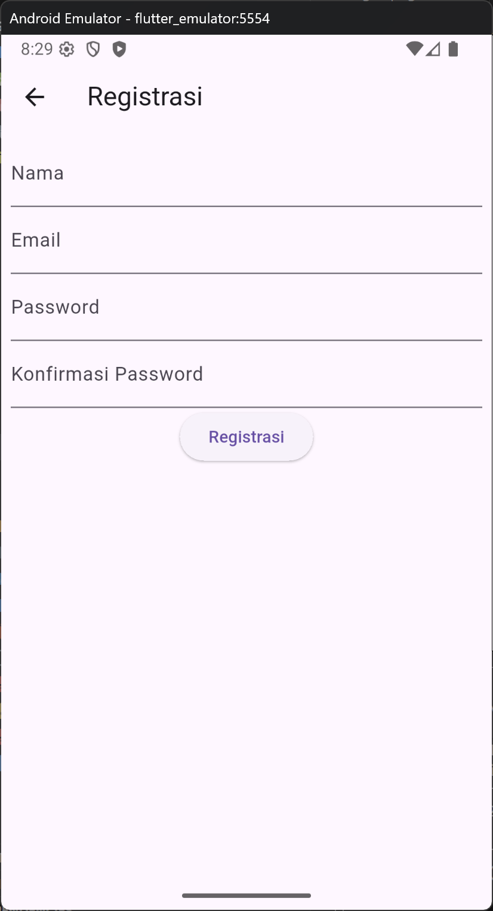
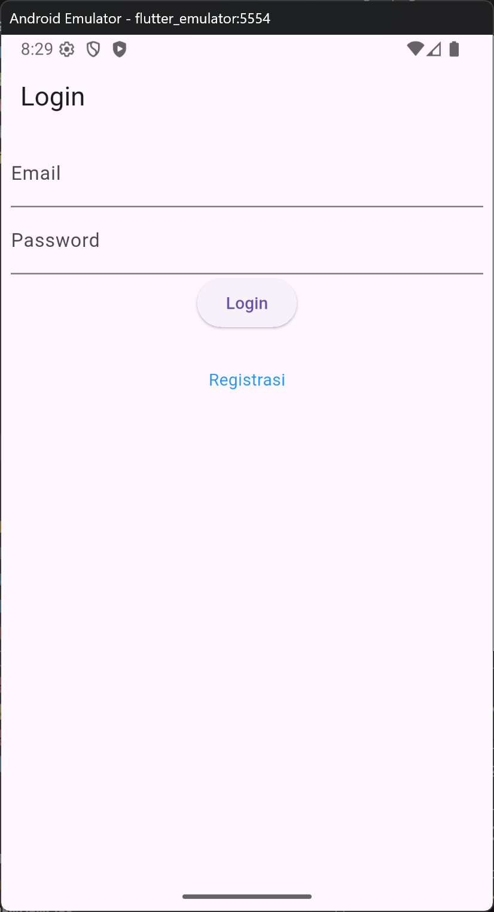
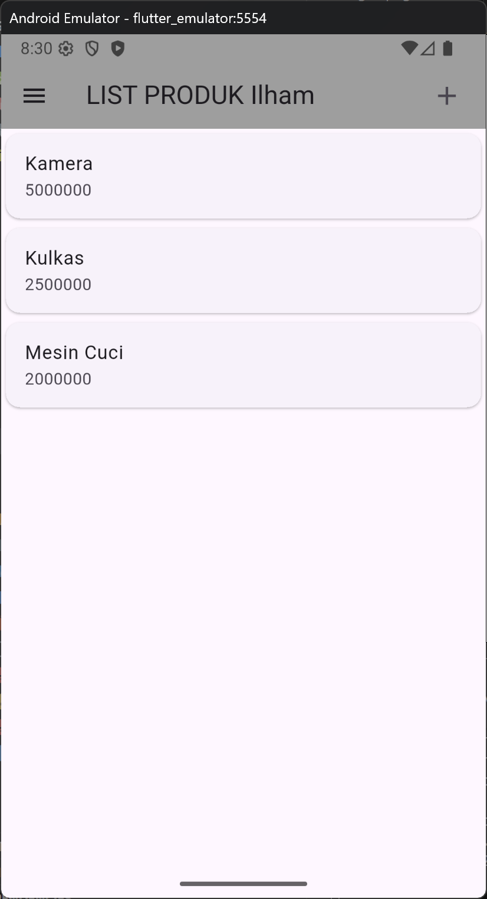
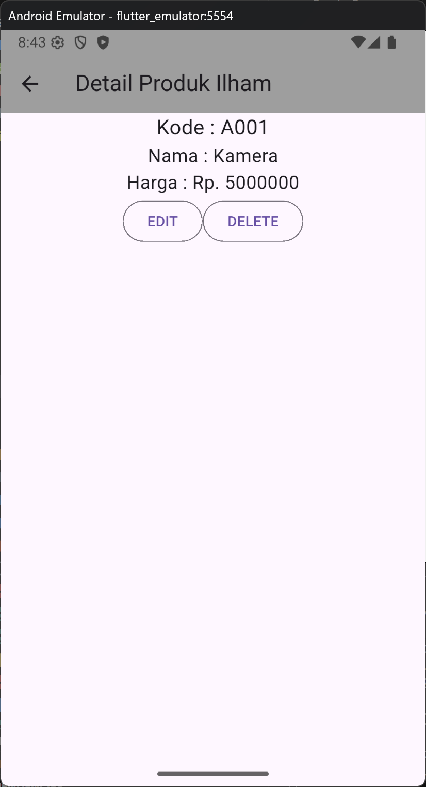
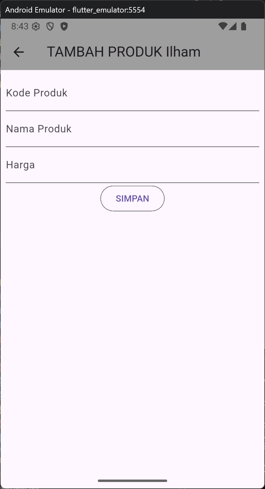

# TokoKita - Aplikasi Manajemen Produk

## Deskripsi
Aplikasi mobile untuk manajemen produk toko yang dibangun menggunakan Flutter. Aplikasi ini memungkinkan pengguna untuk melakukan operasi CRUD (Create, Read, Update, Delete) pada data produk.

## Struktur Aplikasi

### Model
- **Produk** (`model/produk.dart`): Model data produk dengan atribut id, kodeProduk, namaProduk, dan hargaProduk
- **Login** (`model/login.dart`): Model untuk autentikasi user dengan token-based authentication (code, status, token, userID, userEmail)
- **Registrasi** (`model/registrasi.dart`): Model response registrasi user baru dengan atribut code, status, dan data

### UI Pages
1. **RegistrasiPage** (`ui/registrasi_page.dart`)
   - Form registrasi user baru
   - Validasi input: nama (min 3 karakter), email (format valid), password (min 6 karakter)
   - Konfirmasi password

2. **ProdukPage** (`ui/produk_page.dart`)
   - Halaman utama menampilkan list produk
   - Tombol tambah produk di AppBar
   - Drawer menu dengan opsi logout
   - Setiap item produk dapat diklik untuk melihat detail

3. **ProdukDetail** (`ui/produk_detail.dart`)
   - Menampilkan detail lengkap produk (kode, nama, harga)
   - Tombol EDIT untuk mengubah produk
   - Tombol DELETE dengan konfirmasi dialog

4. **ProdukForm** (`ui/produk_form.dart`)
   - Form untuk tambah/ubah produk
   - Mode dinamis (TAMBAH/UBAH) berdasarkan parameter
   - Validasi input untuk semua field

## Alur Kerja Aplikasi

1. **Registrasi**: User mengisi form registrasi → validasi input → kirim ke server → terima response (Registrasi model)
2. **Login**: User login dengan email/password → menerima token autentikasi (Login model)
3. **List Produk**: Menampilkan semua produk → klik produk untuk detail
4. **Tambah Produk**: Klik tombol + → isi form → simpan
5. **Edit Produk**: Dari detail produk → klik EDIT → ubah data → simpan
6. **Hapus Produk**: Dari detail produk → klik DELETE → konfirmasi → hapus

## Fitur Validasi
- Form validation menggunakan `GlobalKey<FormState>`
- Loading state untuk operasi async
- Dialog konfirmasi untuk aksi delete
- Warning dialog untuk error handling

## Screenshot Aplikasi

